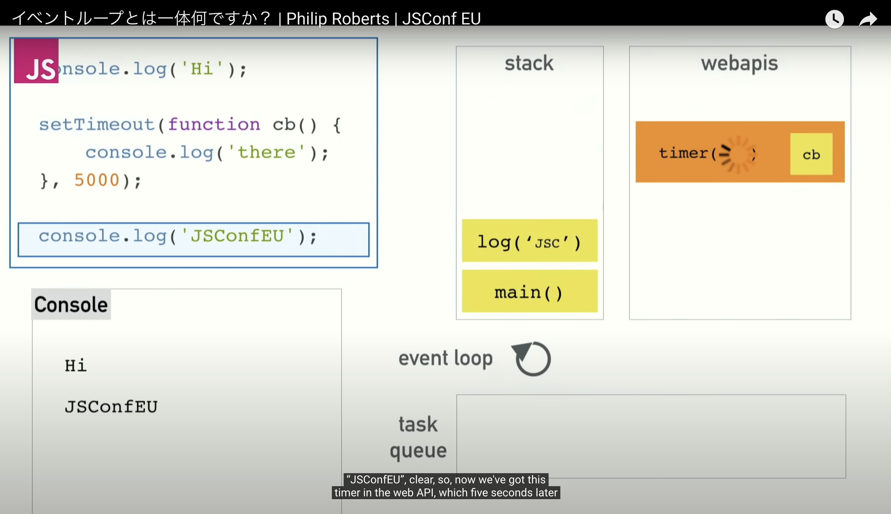
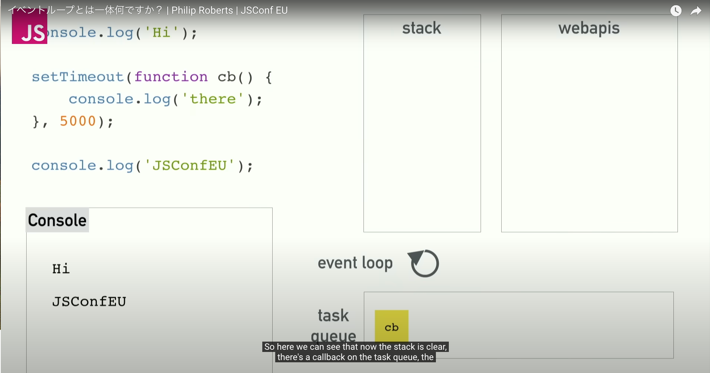
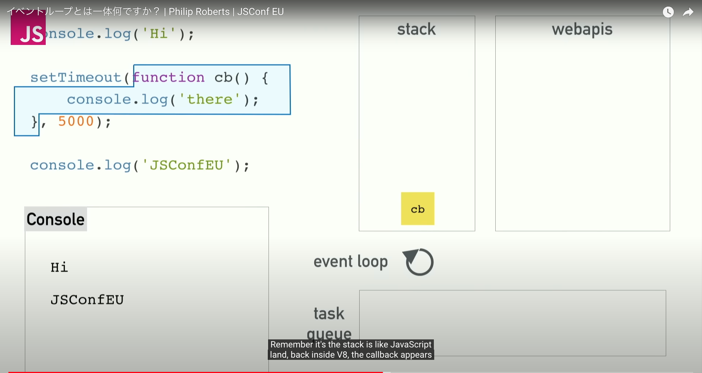

```js
setTimeout(() => console.log("Hello, world!"), 1000);

function longRunningFunction() {
  while (true) {
    // NOTE: while (true) {} は極端な例であり、現実で見ることは少ないかもしれません。
    // しかし、時間のかかる同期処理を実行して同様の問題が発生することは実際にあります。
  }
}

longRunningFunction();
```

## 予想

コンソールには何も表示されない  
(`console.log("Hello, world!")`は実行されない)

## 結果

コンソールには何も表示されなかった。

## 説明

**`setTimeout()`はWebAPIの1つ**であり、JavaScriptエンジン自体の一部ではない。`setTimeout()`が使用されると、そのコールバック関数はコールスタックではなく、**タスクキュー**に置かれる。

`setTimeout()`のコールバックは、指定された遅延時間が経過した後にタスクキューに追加される。イベントループはコールスタックを監視し、コールスタックが空になったとき(つまり、現在実行中のすべてのJavaScriptコードが完了したとき)、イベントループはタスクキューから次のタスクを取り出してコールスタックにプッシュし、実行する。

したがって、コールスタック中にある実行中のコードが非常に時間のかかる処理を行っている場合、イベントループはタスクキューから新しいタスクをコールスタックに移動して実行することができない。

今回のコードでは`while (true) {}`という無限ループによって`longRunningFunction()`がコールスタック中に残り続ける。そのため、タスクキュー中の`console.log("Hello, world!")`をコールスタックに移動することができず、実行不可となってしまう。







### 参考

[What the heck is the event loop anyway?](https://www.youtube.com/watch?v=8aGhZQkoFbQ)
