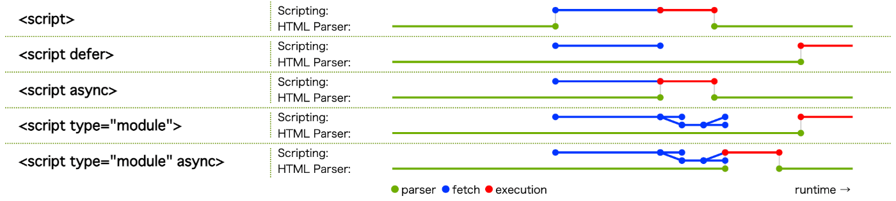

## 問題2

index.html ファイル内の script タグから `type="module"` 属性を削除した場合、期待通り動作させるにはどうすべきか

## 回答

スクリプトの読み込みを`DOMContentLoaded`イベントでラップする。

### 理由

[参考:script要素のJavaScript読み込みパターンについて](https://zenn.dev/oreo2990/articles/a93d3b1088c2fc)

`type="module"`を使用しスクリプトをモジュールとして実行する場合、スクリプトは非同期で読み込まれ、HTMLのパースが完了した後に実行される(図を参照)。

しかし、`type="module"`を削除するとスクリプトが同期的に読みこみ・実行されるため、HTMLの読み込みが完了する前にスクリプトが実行されてしまい、期待通りに動作しない。

HMTLのパース完了後にスクリプトが実行されることを保証するには、`DOMContentLoaded`イベントでスクリプトの読み込みをラップすればよい。`DOMContentLoaded`イベントは、「HTMLドキュメントの完全な読み込みと解析が完了したときに発生するイベント」である。したがって、この記述を加えればHTMLドキュメントの完全なパースが完了してからスクリプトが発火し、`type="module"`削除前と同様に動作する。