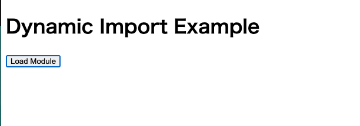
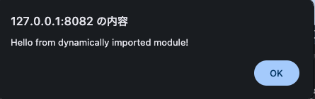

## 動作確認方法

`index.html`で`main.js`を読み込む。
`main.js`には、ボタンがクリックされたときにモジュールを動的にインポートし、そのモジュールの関数を呼び出す処理を記述している。
インポートが成功すれば、`module.js`に記述された処理が実行され、アラートが表示されるはずである。




比較のため、クロスサイトと同一オリジンの場合の双方で実行した。

## 結果

- 同一オリジンの場合、ボタンをクリックするとアラートが表示された。
- クロスサイトにした場合、ボタンをクリックしても何も起こらなかった。

## 説明

クロスサイトで実行した場合もGETリクエストは200(OK)で成功しているが、CORSポリシーによりブロックされるため、インポートに失敗する。

CORS(Cross-Origin Resource Sharing)ポリシーとは、異なるオリジンにある選択されたリソースへのアクセス権を与えるようブラウザーに指示するための仕組みである。

通常ブラウザは同一オリジンポリシー(same-origin policy) に従う。つまり、異なるオリジンに対してリソースのリクエストを行うことができない。オリジンとはURLのうちスキーム、ホスト、ドメイン、ポート番号を合わせたものである。今回はlocalhost:8080とlocalhost:8081でポート番号が異なるため、異なるオリジンとみなされてアクセスがブロックされる。

同一オリジンポリシーがない場合、CSRF(クロスサイトリクエストフォージェリ)などの被害に繋がる。たとえば、銀行サイトにログイン済みのユーザーが悪意あるサイトにアクセスすると、そのサイトがユーザーのセッション情報を利用して銀行口座にアクセスし、不正な引き落としや送金処理を実行するといったことが発生し得る。

とはいえ、同一オリジンでないリソースに全くアクセスできないのは不便である。そのため、異なるオリジン間でも特定のオリジンに対してはリソースへのアクセス許可をするなど、安全なアクセス制御の仕組みを実現する仕組みとしてCORSポリシーが存在する。今回は特段CORSヘッダーでクロスオリジンのアクセス許可をする設定をしていないため、クロスオリジンのアクセスはブロックされてしまう。

```
Access to script at 'http://localhost:8081/module.js' from origin 'http://127.0.0.1:8080' has been blocked by CORS policy: No 'Access-Control-Allow-Origin' header is present on the requested resource.
main.js:2


GET http://localhost:8081/module.js net::ERR_FAILED 200 (OK)
```
