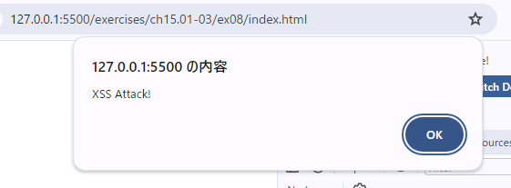

data.jsonのnameプロパティの値を以下のような悪意あるスクリプト(アラートを表示する)に書き換えた。  
ただし、ブラウザがエスケープを行っているらしく、アラートは表示されなかった。
```javascript
{
  "name": "<script>alert('XSS Attack!');</script>",
  "age": 50
}
```


次に、タグのsrc属性に無効な値を設定し、`onerror`イベントを使ってアラートの表示を試みた(`onerror`イベントは画像の読み込みに失敗したときに実行される)。  

今回はブラウザがスクリプトを無視せずにスクリプトが実行された。
```javascript
{
  "name": "",
  "age": 50
}
```

