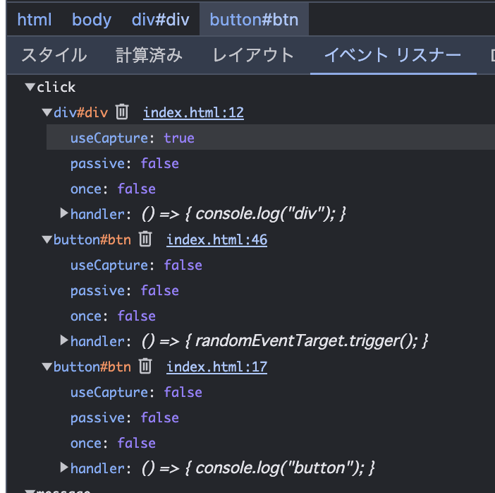

## ボタン押下時のコンソール出力結果

```
div
button
```

イベントがキャプチャリングフェーズで補足されるのでdivから表示される。

## captureの値を変更

divとbuttonのコンソール出力順序が逆になる。
イベントがキャプチャリングフェーズでは補足されず、バブリングフェーズで補足されるため。


## script中のコメント1.～4.の指示に従いカスタムイベントの関連コードを完成

実施。

## ブラウザのデバッグツール(Chromeの場合はDeveloper ToolのEvent Listners)で、btn等に登録されているイベントをそれぞれ確認

クリックイベントがdivには1つ、btnには2つ登録されていた。  
前者はクリック時にコンソールに"div"と出力するためのもので、後者はクリック時にコンソールに"div"と出力するためのものと、乱数を生成するためのものだった。


