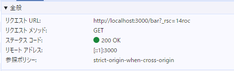

## ブラウザの開発者ツールの「ネットワーク」タブを確認してみよう。リンクをクリックしたときに通信は発生しているだろうか？

サーバーにページ全体を取得するようなリクエストは送信されていなかった。
ただし、`http://localhost:3000/bar?_rsc=14roc`のように、クエリパラメータ形式でGETリクエストが発生していた。

## pushState はいつ実行されているだろうか？

リンクをクリックしたとき。
おそらくリンクのクリックイベントハンドラ内で`pushState`が呼び出されている。

## 15.4-10.12 では pushState を使った実装でページのリロード時に正しく動作しなかったが、この問題ではどうだろうか？

正しく現在のページが表示された。