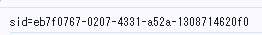
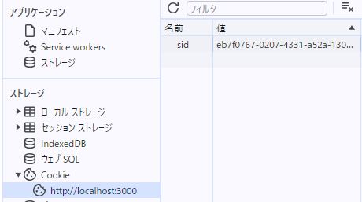

# 問題

## 問1

 `contents/index.js` を変更し、上記の API を `fetch`を使って呼び出すことで、ToDo リストの状態をクライアントではなくサーバ側で管理する ToDo アプリケーションを完成させなさい。ただし index.html ファイルは編集してはいけない。サーバからエラーレスポンスが返却されたときは、ToDo リストの表示を更新させずエラーの内容を `alert` で表示する。

### 回答

実施。

## 問2

このサーバでは Cookie を使ってクライアントのセッションを識別し、タスク一覧をセッションごとに分離して管理する簡易的な認証/認可を行っている。サーバが設定している Cookie の値は `sid=<セッションに一意に割り当てた ID>; SameSite=Lax; Path=/; HttpOnly;` である。ToDo アプリでいくつかのタスクを作成した後、以下に挙げる操作を実施したとき、それぞれどのような結果になるか記載し、その理由を説明しなさい。

### 回答

### index.js で`document.cookie` プロパティを `console.log`で表示する

何も表示されなかった。  
HttpOnly属性が有効になっており、JavaScriptからCookieが参照できなくなっているからだと思われる。

```javascript
  // HttpOnly を有効にしてクライアントの JavaScript から Cookie を参照できないようにする
  res.setHeader(
    "Set-Cookie",
    `sid=${encodeURIComponent(sid)}; SameSite=Lax; Path=/; HttpOnly;`,
  );
  ```

試しに以下のようにコードを書き換えて無効化したところ、コンソールにセッションIDが表示された。

```javascript
  // HttpOnly を無効にしてクライアントの JavaScript から Cookie を参照できるようにする
  res.setHeader(
    "Set-Cookie",
    `sid=${encodeURIComponent(sid)}; SameSite=Lax; Path=/;`
  );
```



### ブラウザの開発者コンソールで http://localhost:3000/ の Cookie を表示する

ブラウザの開発者コンソールの「アプリケーション」タブから「Cookie」を選択したところ、
`http://localhost:3000`の欄にセッションIDが表示されていた。



### ToDo アプリのタブをリロードする

セッションIDの値は変わらず、元のタスクがそのまま表示された。

### 同一ブラウザの異なるタブやウィンドウで http://localhost:3000/ を開いて ToDo リストの状態を確認する

セッションIDの値は変わらず、元のタスクがそのまま表示された。

### シークレットウィンドウや異なるブラウザで http://localhost:3000/ を開いて ToDo リストの状態を確認する

異なるブラウザから確認したところ、セッションIDの値は異なっており、作成したタスクは表示されなかった。

### http://127.0.0.1:3000/ を開いて ToDo リストの状態を確認する

セッションIDの値は異なっており、作成したタスクは表示されなかった。  
localhostと127.0.0.1は同じホストを指すが、ブラウザからは異なるオリジンとして扱われるのだと思われる。
