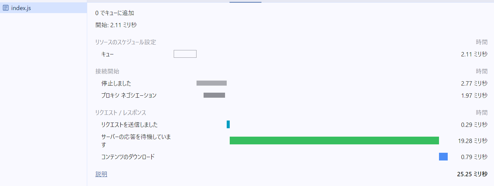
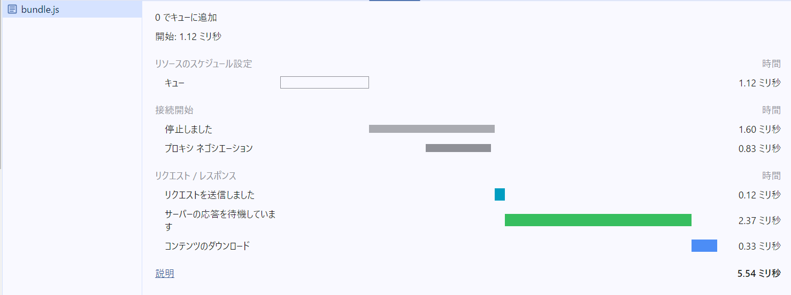

# ch17/ex05

## バンドルしたコードの処理

- モジュール分割されたコードが結合されていた
- コメントが追加されていた
  - 元のコードがどのファイルから来たのかを追跡するためのデバッグ用情報らしい

## バンドル前後それぞれのコードの比較

結果：バンドル後の方がスクリプトのダウンロード速度、ページの表示速度ともに速かった。

### index.js

スクリプトのダウンロード時間：0.79ミリ秒
ページの読み込み完了時間：25.25ミリ秒

### bundle.js

スクリプトのダウンロード時間：0.33ミリ秒
ページの読み込み完了時間：5.54ミリ秒

