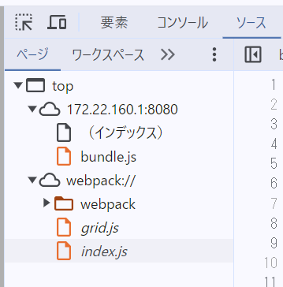
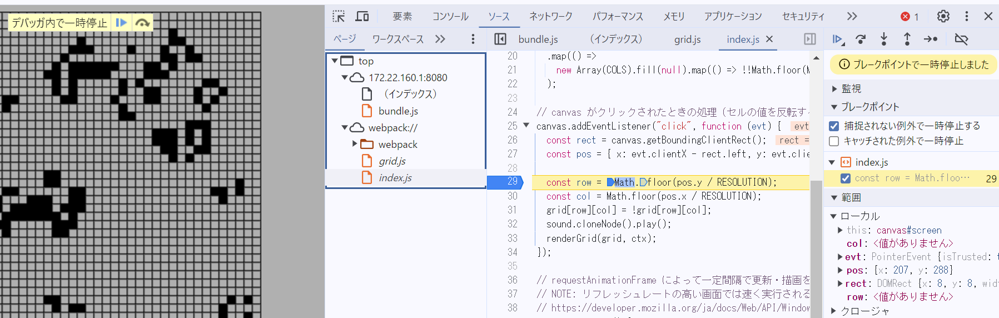

# ch17/ex06

## 開発者ツールの`ソース` タブでソースコードファイルがどのように表示されるか

元々の`index.js`と`grid.js`のソースコードも表示されていた。

## バンドルしたコードの実行中に、バンドル前のソースコードファイルに基づいたブレークポイントの設定や変数の値の確認等のデバッグが可能か

バンドル前のコードにブレークポイントを設定して実行したところ、そのブレークポイントで一時停止することができた。

